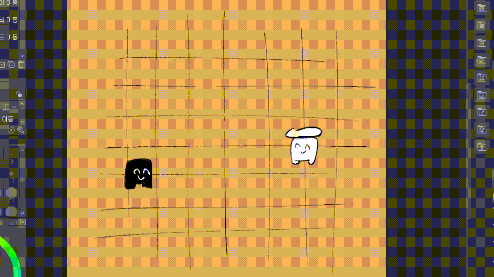

# Portfolio
## 세상을 여는 게임 개발자, 국가람
 게임 개발자를 꿈꾸는 국가람입니다. 저는 어렸을 적 게임 속에서 현실과는 다른 새로운 세상을 보았습니다. 그렇게 저는 게임과 함께 자라 어른이 되었고, 이제는 제가 게임을 만드는 쪽이 되어 다른 이들에게 새로운 세상을 보여주고 싶습니다.

## 학력
* (2022.02) 상일미디어고등학교 디지털미디어디자인과 졸업
* (2022.03 ~ ) <a href="./image/국가람_서일대학교_성적증명서.pdf">서일대학교 소프트웨어공학과 재학중</a>
   
## 자격증
* (2021.07) <a href="./image/국가람_컴퓨터그래픽스운용기능사.pdf">컴퓨터그래픽스운용기능사 자격증 취득</a>
* (2023.09) <a href="./image/국가람_정보처리기능사.pdf">정보처리기능사 자격증 취득</a>
* (2024.01) JLPT N2 자격증 취득

## 기술스택
* <a href="https://blog.naver.com/PostList.naver?blogId=g4ram_&from=postList&categoryNo=11">C#</a>
* <a href="https://blog.naver.com/PostList.naver?blogId=g4ram_&categoryNo=9&from=postList">Unity</a>

## 프로젝트
* 재능기부 원데이 클래스 앱 "Give&Take" UI 디자인 및 구현
   
   <a href="https://www.figma.com/design/UNsApITJ72SP3hfi06S5zQ/figma_%EA%B5%AD%EA%B0%80%EB%9E%8C?node-id=0-">Figma</a>
     
   
   

* 변칙 캐릭터 오목 게임 개발中

  Link : https://github.com/JIN-YOO-YU/Omok
     
      
  
   
   
## 취업준비활동
* 사이버진로교육센터 온라인 강의 수강 <a href="./image/국가람_온라인교육수료증.pdf">PDF</a>
  * 123123

## 연락처
email : garam4266211@gmail.com
