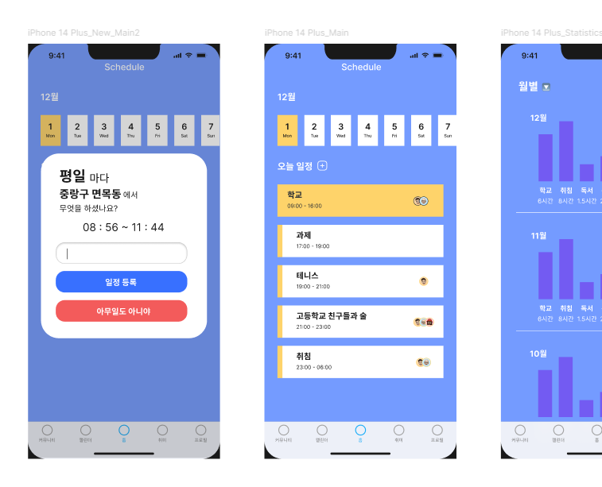

# Portfolio
## 자기소개
안녕하세요 게임개발자 국가람 입니다. 사람들의 기억에 남을 게임 개발에 함께하고 싶습니다.

## 학력
* (20XX.XX.XX) 상일미디어고등학교 디지털미디어디자인과 졸업
* (20XX.XX.XX) 서일대학교 소프트웨어공학과 졸업 예정

## 자격증
* (20XX.XX.XX) 컴퓨터그래픽스운용기능사 자격증 취득
* (20XX.XX.XX) 정보처리기능사 자격증 취득
* (20XX.XX.XX) JLPT N2 자격증 취득

## 기술스택
* C#
* Unity
* 추가예정.   

## 프로젝트
* 재능기부 원데이 클래스 앱 "Give&Take"

    
  

* 나만의 AI비서 앱 "나비" 디자인

   
   
## 연락처
email : garam4266211@gmail.com
