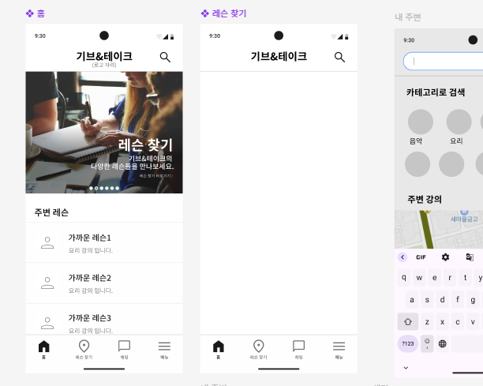

# Portfolio
## 세상을 여는 게임 개발자, 국가람
 게임 개발자를 꿈꾸는 국가람입니다. 저는 어렸을 적 게임 속에서 현실과는 다른 새로운 세상을 보았습니다. 그렇게 저는 게임과 함께 자라 어른이 되었고, 이제는 제가 게임을 만드는 쪽이 되어 다른 이들에게 새로운 세상을 보여주고 싶습니다.

## 학력
* (2022.02) 상일미디어고등학교 디지털미디어디자인과 졸업
* (2022.03 ~ ) <a href="./image/국가람_서일대학교_성적증명서.pdf">서일대학교 소프트웨어공학과 재학중</a>
   
## 자격증
* (2021.07) <a href="./image/국가람_컴퓨터그래픽스운용기능사.pdf">컴퓨터그래픽스운용기능사 자격증 취득</a>
* (2023.09) <a href="./image/국가람_정보처리기능사.pdf">정보처리기능사 자격증 취득</a>
* (2024.01) JLPT N2 자격증 취득

## 기술스택
* <a href="https://blog.naver.com/PostList.naver?blogId=g4ram_&from=postList&categoryNo=11">C#</a>
* <a href="https://blog.naver.com/PostList.naver?blogId=g4ram_&categoryNo=9&from=postList">Unity</a>

## 프로젝트
* 재능기부 원데이 클래스 앱 "Give&Take" UI 디자인 및 구현
   
   <a href="https://www.figma.com/design/UNsApITJ72SP3hfi06S5zQ/figma_%EA%B5%AD%EA%B0%80%EB%9E%8C?node-id=0-">Figma</a>
     
   
   

* 변칙 캐릭터 오목 게임 개발中

  Link : https://github.com/JIN-YOO-YU/Omok
     
      
  
   
   
## 취업준비활동
* <b>사이버진로교육센터 온라인 강의 수강</b> <a href="./image/국가람_온라인교육수료증.pdf">PDF</a>
  * 마음을 사로잡는 면접전형 준비
  * 시선을 사로잡는 서류전형 준비
  * 나의 진로, 첫걸음 - 계획 수립을 위한 정보 탐색!
  * 구직정보 분석의 모든 것: 산업, 기업, 직무분석
* <b>서일대학교 언택트 진로특강, 취업특강 이수</b> <a href="./image/국가람_언택트진로취업특강.pdf">PDF</a>
* <b>재맞고 진로취업 특강(직업선호도 검사 L형) 참여</b> <a href="./image/국가람_직업선호도검사.pdf">PDF</a>
* <b>서일대학교 소프트웨어공학과 학생들을 위한 취업특강</b> <a href="./image/국가람_취업특강참여확인서.pdf">PDF</a>
* <b>AI EXPO KOREA 2025 참관(COEX, 2025.05.16)</b> <a href="./image/국가람_박람회참여확인서.pdf">PDF</a>

## 연락처
email : garam4266211@gmail.com
